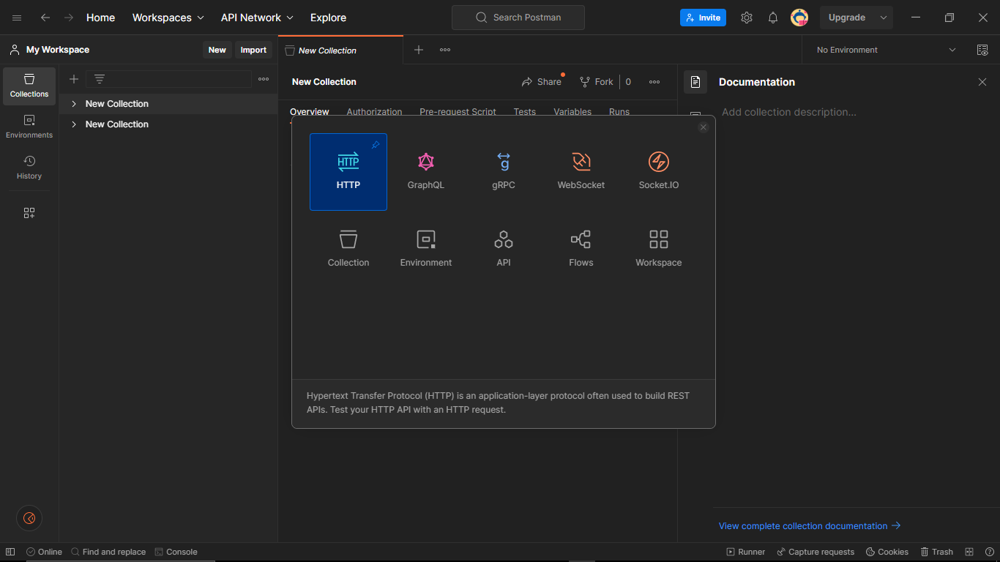
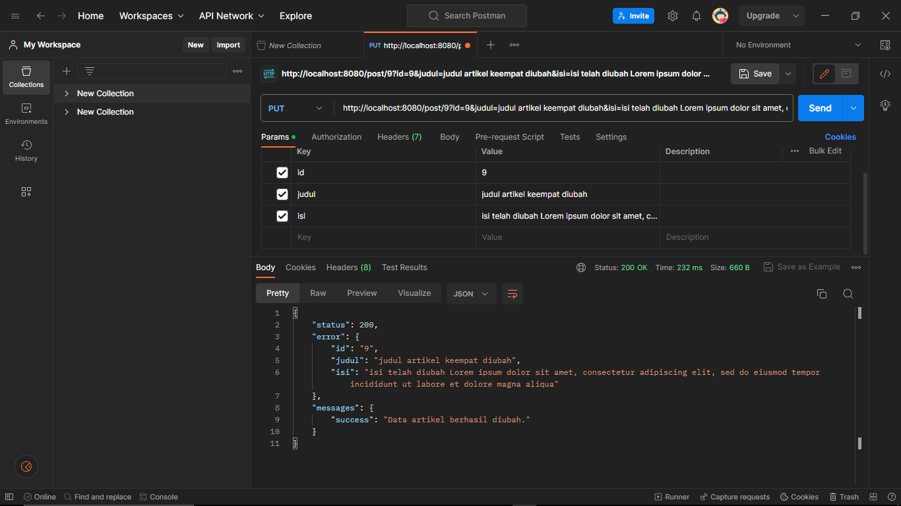
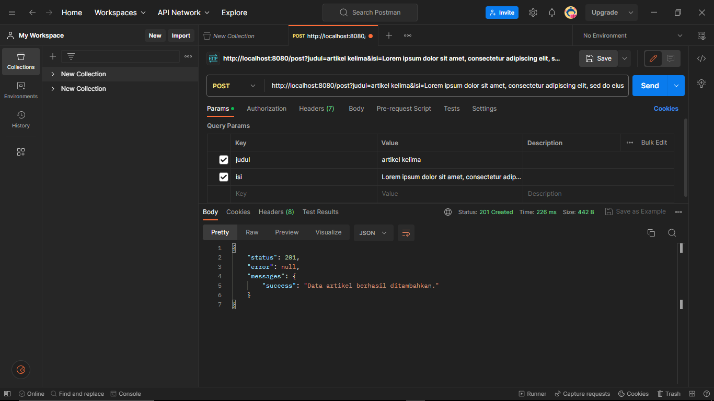
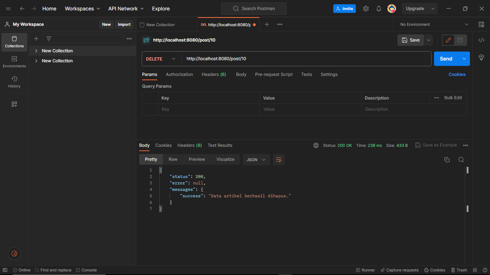

## Praktikum 12: Framework Lanjutan
### menggunakan API
Pada modul sebelumnya sudah dibuat ArtikelModel, pada modul ini kita akan memanfaatkan model
tersebut agar dapat diakses melalui API.

dengan menambah kan sintaks seperti yang ada pada module praktikum 12

- Buka aplikasi postman dan pilih create new → HTTP Request

- menampilkan semua data artikel dari database,

- menampilkan data artikel yang memiliki ID
nomor 9 di database.

- mengubah data
 
- hasil mengubah data
 
- Menambahkan Data
  
- hasil Menambahkan Data
  
- Menghapus Data

- hasil Menghapus Data
